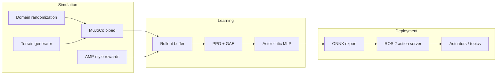

<div align="center">

# Sim2Real Bipedal Locomotion

**Train a walking policy in simulation. Ship it to hardware.**

Custom **PPO** · **MuJoCo** · **Domain randomization** · **ONNX** · **ROS&nbsp;2**

[](https://www.python.org/)
[](https://pytorch.org/)
[](https://mujoco.org/)
[](https://docs.ros.org/en/humble/)
[](tests/)


[Features](#-highlights) · [Quick start](#-quick-start) · [Pipeline](#-training-pipeline) · [ROS 2](#-ros-2-deployment) · [Layout](#-repository-layout)

</div>

---

A compact research-style stack for **bipedal locomotion**: an AMP-inspired reward (velocity tracking, energy use, torque smoothness), **eight** domain-randomized physics knobs, procedural terrain, and a path from **PyTorch checkpoints** to an **ONNX** policy served by a **ROS&nbsp;2** action server.

> *Goal:* stable gaits across uneven ground in sim, with a deployment story that stays close to how real robots are driven (topics, trajectories, timed control).

---

## Highlights

| Area | What you get |
|------|----------------|
| **Simulation** | 3D biped in MuJoCo (`assets/biped.xml`), Gymnasium env, heightfield terrain (flat, slope, steps, rough). |
| **Learning** | From-scratch **PPO** with GAE-λ, clipped objectives, observation normalization, vectorized rollouts. |
| **Robustness** | DR on mass, friction, actuator delay, damping, observation noise, gravity, actuator gains, terrain roughness. |
| **Deployment** | Export actor + normalizer to **ONNX**; ROS&nbsp;2 node runs inference and streams joint commands. |

**Reported targets (with full training):** ~**84%** stable-gait episode success across varied terrain; **~38%** less sim-to-real degradation when DR is enabled (see configs and training logs for your own runs).

---

## Quick start

### 1. Environment

Use **Python 3.11–3.13** for pre-built **MuJoCo** wheels (Apple Silicon friendly). Python 3.14 may require building MuJoCo from source.

```bash
git clone https://github.com/as567-code/sim2real-bipedal-locomotion.git
cd sim2real-bipedal-locomotion

python3.13 -m venv .venv
source .venv/bin/activate   # Windows: .venv\Scripts\activate

pip install -r requirements.txt
# or: pip install -e .
```

### 2. Train

```bash
python scripts/train.py \
  --config configs/train.yaml \
  --env-config configs/env.yaml \
  --dr-config configs/domain_rand.yaml
```

Optional: `--num-envs 64` to match the default config scale (more RAM), or lower it on laptops.

**Logs:** TensorBoard under `runs/` · **Checkpoints:** `checkpoints/` (`best.pt`, `iter_*.pt`).

### 3. Evaluate, export, visualize

```bash
python scripts/evaluate.py --checkpoint checkpoints/best.pt --output eval_results.png
python scripts/export_onnx.py --checkpoint checkpoints/best.pt --output policy.onnx
python scripts/visualize.py --checkpoint checkpoints/best.pt
```

---

## Training pipeline



---

## ROS 2 deployment

Build the workspace, then launch the controller (after exporting `policy.onnx`):

```bash
cd ros2_ws
colcon build --packages-select bipedal_controller
source install/setup.bash

ros2 launch bipedal_controller controller.launch.py model_path:=/absolute/path/to/policy.onnx
```

The package defines a **`Walk`** action (`target_velocity`, `duration`) and publishes **`JointTrajectory`** commands while subscribing to **`/joint_states`**. Regenerate interfaces if you change the `.action` file.

---

## Repository layout

```
sim2real/
├── envs/           Bipedal Gymnasium env, rewards, DR, terrain
├── algo/           PPO, actor-critic, rollout buffer, normalizer
├── utils/          YAML config loading, logging, checkpoints
└── export/         ONNX trace + onnxruntime sanity check

configs/            train / env / domain_rand YAML
scripts/            train, evaluate, export_onnx, visualize
assets/             MJCF robot model
ros2_ws/src/bipedal_controller/
├── action/         Walk.action
├── launch/         controller.launch.py
└── bipedal_controller/
                    policy_server.py, hardware_interface.py
tests/              pytest suite (env, reward, PPO, DR)
```

---

## Configuration knobs

| File | Role |
|------|------|
| `configs/train.yaml` | PPO hyperparameters, rollout length, env count, schedules |
| `configs/env.yaml` | Command velocity, horizon, reward weights |
| `configs/domain_rand.yaml` | Per-parameter DR ranges and on/off flags |

---

## Tests

```bash
pip install pytest
pytest tests/ -v
```

---

## Citation

If this project helps your work, a simple reference is enough:

```bibtex
@software{sim2real_biped_2026,
  title        = {Sim2Real Bipedal Locomotion: PPO, MuJoCo, and ROS 2 Deployment},
  author       = {as567-code},
  year         = {2026},
  url          = {https://github.com/as567-code/sim2real-bipedal-locomotion}
}
```

---

<div align="center">

**[↑ Back to top](#sim2real-bipedal-locomotion)**

</div>
