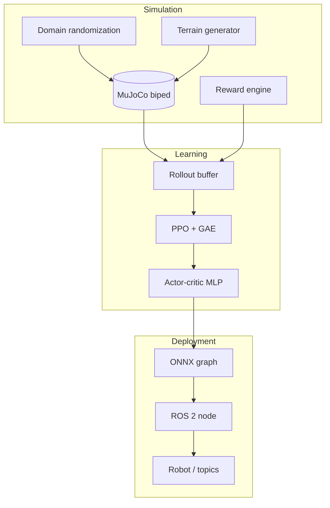

<div align="center">

<br/>

# Sim2Real Bipedal Locomotion

### Simulation-trained walking policies for a MuJoCo biped — from PPO to ONNX and ROS&nbsp;2

<br/>

[](https://www.python.org/)
[](https://pytorch.org/)
[](https://mujoco.org/)
[](https://docs.ros.org/en/humble/)

<br/>

[](tests/)
[](LICENSE)

<br/>

**[Overview](#overview)** &nbsp;·&nbsp; **[Features](#features)** &nbsp;·&nbsp; **[Quick start](#quick-start)** &nbsp;·&nbsp; **[Pipeline](#system-pipeline)** &nbsp;·&nbsp; **[ROS 2](#ros-2-deployment)** &nbsp;·&nbsp; **[Layout](#repository-layout)**

<br/>

</div>

---

## Overview

This repository is an **end-to-end research engineering** baseline: train a **proximal policy optimization (PPO)** controller for a **3D bipedal** model in **MuJoCo**, encourage stable locomotion with a **decomposed, AMP-style reward** (velocity tracking, energy and torque-smoothness terms), improve robustness with **domain randomization** over eight simulation parameters, then **export** the actor (with observation normalization baked in) to **ONNX** and run it from a **ROS&nbsp;2** package aimed at hardware-style I/O (`/joint_states`, joint command trajectories).

> **Scope.** Simulation metrics (return, success criteria you define, TensorBoard curves) are produced by this repo. **Quantitative sim-to-real claims** (for example, success rates on hardware or percent improvement from DR) require **your own** experiments and logging; they are not hard-coded outcomes of the software.

---

## Features

| Layer | Details |
| :--- | :--- |
| **Environment** | [`BipedalEnv`](sim2real/envs/bipedal_env.py) (Gymnasium) around [`assets/biped.xml`](assets/biped.xml); procedural **heightfield** terrain (flat, slope, steps, rough). |
| **Reward** | Configurable weights in [`configs/env.yaml`](configs/env.yaml): velocity command tracking, orientation, energy / torque stability, joint velocity, foot clearance, symmetry, alive bonus. |
| **Learning** | Custom **PPO** with GAE-λ, clipped surrogate, value clipping, entropy schedule, gradient clipping; **running observation normalization**; vectorized rollouts ([`sim2real/algo/`](sim2real/algo/)). |
| **Domain randomization** | Mass, ground friction, actuator delay, joint damping, observation noise, gravity, actuator gains, terrain roughness — toggles and ranges in [`configs/domain_rand.yaml`](configs/domain_rand.yaml). |
| **Deployment** | [`export_onnx.py`](scripts/export_onnx.py): actor mean with **[-1, 1] clamp** (aligned with training-time env clipping, not `tanh` on the mean). ONNX Runtime checks in [`sim2real/export/onnx_export.py`](sim2real/export/onnx_export.py). |
| **ROS 2** | [`bipedal_controller`](ros2_ws/src/bipedal_controller/): `Walk` action, ONNX inference loop, [`hardware_interface`](ros2_ws/src/bipedal_controller/bipedal_controller/hardware_interface.py) for joint ordering and torque limits. |

---

## Quick start

### Prerequisites

- **Python 3.11–3.13** recommended (pre-built **MuJoCo** wheels; **3.14** may need a source build).
- For ROS&nbsp;2: **Humble** (or adapt paths for your distro).

### Install

```bash
git clone https://github.com/as567-code/sim2real-bipedal-locomotion.git
cd sim2real-bipedal-locomotion

python3.13 -m venv .venv
source .venv/bin/activate   # Windows: .venv\Scripts\activate

pip install -r requirements.txt
# optional editable install:
# pip install -e .
```

### Train

```bash
python scripts/train.py \
  --config configs/train.yaml \
  --env-config configs/env.yaml \
  --dr-config configs/domain_rand.yaml
```

Use `--num-envs N` to scale parallelism (default in YAML is tuned for strong machines). **TensorBoard:** `runs/`. **Checkpoints:** `checkpoints/best.pt`, `checkpoints/iter_*.pt`.

**Resume** after interruption:

```bash
python scripts/train.py ... --resume checkpoints/iter_000100.pt
```

Checkpoint iteration handling matches completed PPO updates (no duplicate iteration on resume).

### Evaluate · export · visualize

```bash
python scripts/evaluate.py --checkpoint checkpoints/best.pt --output eval_results.png
python scripts/export_onnx.py --checkpoint checkpoints/best.pt --output policy.onnx
python scripts/visualize.py --checkpoint checkpoints/best.pt
```

### Measuring performance

- **In simulation:** use `scripts/evaluate.py`, TensorBoard scalars from `scripts/train.py`, and your own definition of “stable gait” / success.
- **Sim-to-real:** compare policies with and without DR (or sim vs hardware) using **your** robot, sensors, and safety harness; this repository does not ship a validated hardware benchmark.

---

## System pipeline



---

## ROS 2 deployment

```bash
cd ros2_ws
colcon build --packages-select bipedal_controller
source install/setup.bash

ros2 launch bipedal_controller controller.launch.py model_path:=/absolute/path/to/policy.onnx
```

The **`Walk`** action carries `target_velocity` and `duration`. The node subscribes to **`/joint_states`** and publishes **`JointTrajectory`**-style commands. **IMU and foot contacts** in the observation are placeholders in [`policy_server.py`](ros2_ws/src/bipedal_controller/bipedal_controller/policy_server.py); wire them to your stack before relying on closed-loop behavior on hardware. Rebuild interfaces if you edit [`Walk.action`](ros2_ws/src/bipedal_controller/action/Walk.action).

---

## Repository layout

```
sim2real/
├── envs/          Bipedal env, rewards, domain randomization, terrain
├── algo/          PPO, actor-critic, rollout buffer, normalizer
├── utils/         Config loading, logging, checkpoints
└── export/        ONNX export and optional Runtime validation

configs/           train.yaml, env.yaml, domain_rand.yaml
scripts/           train, evaluate, export_onnx, visualize
assets/            MJCF robot (biped.xml)
ros2_ws/src/bipedal_controller/   ROS 2 package + launch + action
tests/             pytest (env, reward, PPO, DR)
```

---

## Configuration

| File | Purpose |
| :--- | :--- |
| [`configs/train.yaml`](configs/train.yaml) | PPO hyperparameters, `num_iterations`, rollout length, parallel envs, schedules |
| [`configs/env.yaml`](configs/env.yaml) | Episode horizon, command velocity, reward weights |
| [`configs/domain_rand.yaml`](configs/domain_rand.yaml) | DR ranges and per-parameter enable flags |

---

## Tests

```bash
pip install pytest
pytest tests/ -v
```

---

## Citation

```bibtex
@software{sim2real_biped_2026,
  title        = {Sim2Real Bipedal Locomotion: PPO, MuJoCo, and ROS 2 Deployment},
  author       = {as567-code},
  year         = {2026},
  url          = {https://github.com/as567-code/sim2real-bipedal-locomotion}
}
```

---

<div align="center">

<br/>

<sub>MIT License — see <a href="LICENSE">LICENSE</a>.</sub>

<br/>

**[↑ Back to top](#sim2real-bipedal-locomotion)**

<br/>

</div>
